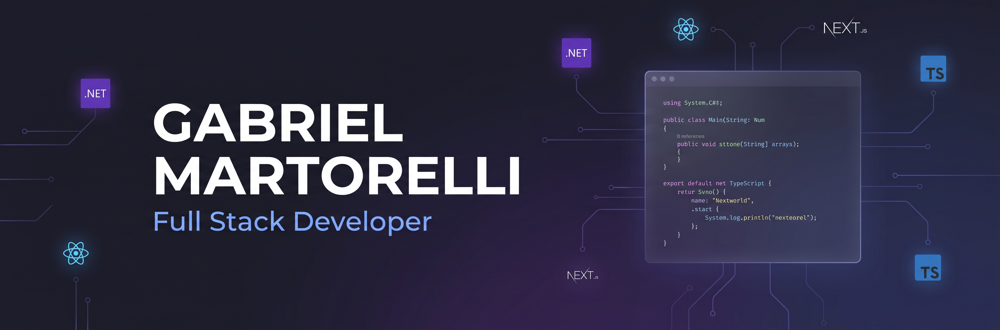

  

<h1 align="center">👋 Olá! Eu sou o Gabriel Martorelli</h1>

  

  💼 <strong>Desenvolvedor Full Stack Jr</strong> na <strong>PROVER Soluções em TI e Software House</strong> 
  🎓 Estudante de <strong>Sistemas de Informação</strong> 
  🛠️ Construindo aplicações reais com <strong>.NET, C#, React, Next.js e TypeScript</strong>

  
  
  
  

  
  

---

## 👨‍💻 Sobre mim

Atualmente atuo como **Desenvolvedor Full Stack Jr na PROVER Soluções em TI e Software House**, aplicando no dia a dia o que venho estudando em desenvolvimento web e arquitetura de software.

Gosto de construir aplicações organizadas, funcionais e fáceis de manter, aplicando boas práticas como **DDD**, **CQRS**, **SOLID**, separação de responsabilidades e documentação de APIs. No backend trabalho com **C#/.NET**, e no frontend com **React**, **Next.js** e **TypeScript**.

> 🌱 Atualmente estudando: **Clean Architecture, CQRS com MediatR, Entity Framework Core, testes unitários com xUnit e Tailwind CSS.**

---

## ⭐ Projetos em destaque

---

### 🍽️ [Restaurante Estoque — Sistema de Controle de Estoque Full Stack](https://github.com/martoxm/restaurante-estoque)

> Projeto desenvolvido na PROVER: sistema de controle de estoque para restaurante, construído do zero — domínio, CQRS, autenticação, regras de estoque e CRUD completo.

| Camada          | Tecnologias                                                                                             |
| :-------------- | :------------------------------------------------------------------------------------------------------ |
| **Backend**     | .NET 10 · C# · Minimal API · CQRS com MediatR · Entity Framework Core · SQL Server · JWT + BCrypt       |
| **Frontend**    | Next.js (App Router) · TypeScript · Tailwind CSS · shadcn/ui · Axios · TanStack Query                   |
| **Arquitetura** | Clean Architecture (Domain → Application → Infrastructure → Api → Contracts) · DDD · Repository Pattern |

**Destaques técnicos:**

- 🧱 DDD com entidades ricas — regras de negócio na própria entidade, não em serviços externos
- 🔐 Autenticação JWT com hash de senha via BCrypt
- 📦 CRUD completo de Produtos, Categorias e Fornecedores + movimentação de estoque com validação de saldo
- 📊 Dashboard com indicadores simples (estoque baixo, totais) e listagens paginadas/ordenáveis
- 🔗 API versionada (`/api/v1`)

---

### 🔐 [Crypto Monitor — Ecossistema Fullstack em Produção 24/7](https://github.com/martoxm/crypto-monitor-fullstack)

> Sistema autônomo de monitoramento de criptoativos rodando em produção real, com infraestrutura cloud completa.

| Camada              | Tecnologias                                                    |
| :------------------ | :------------------------------------------------------------- |
| **Backend**         | .NET 10 · C# · ASP.NET Core · Entity Framework Core · SQLite   |
| **Automação / ETL** | n8n (Docker) · Pipeline de ingestão agendado · CoinGecko API   |
| **Infraestrutura**  | Oracle Cloud VPS · Docker · Nginx (Proxy Reverso) · Systemd    |
| **Segurança**       | TLS/SSL via Certbot (Let's Encrypt) · HTTPS ponta a ponta      |
| **Frontend**        | HTML5 · CSS · JavaScript (Fetch API / CORS) · Deploy na Vercel |
| **Arquitetura**     | DDD · SOLID · Microsserviços desacoplados                      |

**Destaques técnicos:**

- 🌐 Disponível 24/7 em: [crypto-monitor-fullstack.vercel.app](https://crypto-monitor-fullstack.vercel.app/)
- ⚙️ Pipeline ETL automatizado com n8n em container Docker
- 🔒 Infraestrutura segura com SSL, Nginx reverse proxy e Systemd service
- ☁️ Hospedagem em VM Ubuntu na Oracle Cloud com SWAP de 2GB otimizado

---

### 💸 [Controle de Gastos Residenciais — Desafio Técnico Fullstack](https://github.com/martoxm/ControleGastos)

> Sistema web fullstack desenvolvido como teste técnico, do backend ao frontend, do zero.

| Camada          | Tecnologias                                                                    |
| :-------------- | :----------------------------------------------------------------------------- |
| **Backend**     | .NET 10 · C# · ASP.NET Core Web API · Entity Framework Core · SQLite · Swagger |
| **Frontend**    | React 19 · TypeScript · Vite · React Router DOM · Axios                        |
| **Arquitetura** | DDD · SOLID · Separação em camadas                                             |

**Funcionalidades entregues:**

- Cadastro, listagem e remoção de pessoas (exclusão em cascata de transações)
- Regra de negócio: menores de 18 anos só podem registrar despesas
- Relatório financeiro com totais por pessoa e consolidado geral
- Persistência com SQLite · Documentação com Swagger/OpenAPI

---

🛠️ <strong>Tecnologias</strong> (clique para expandir)

### Backend

  
  
  
  
  
  
  
  

### Frontend

  
  
  
  
  
  
  
  

### Ferramentas e práticas

  
  
  
  

**Arquitetura e qualidade:** DDD · CQRS · SOLID · Clean Architecture · Clean Code · APIs REST · Testes unitários com xUnit

**Bibliotecas e ferramentas:** Entity Framework Core · MediatR · Swagger/OpenAPI · FluentValidation · AutoMapper · Axios · TanStack Query

---

## 📊 GitHub Stats

  
  

  

---

## 📫 Vamos conversar?

- **E-mail:** [gabriel.martorelli@hotmail.com](mailto:gabriel.martorelli@hotmail.com)
- **LinkedIn:** [linkedin.com/in/gabrielmartorelli](https://www.linkedin.com/in/gabrielmartorelli/)
- **Portfólio:** [https://www.martodev.online/](https://www.martodev.online/)

  Obrigado por visitar meu perfil! 🚀

